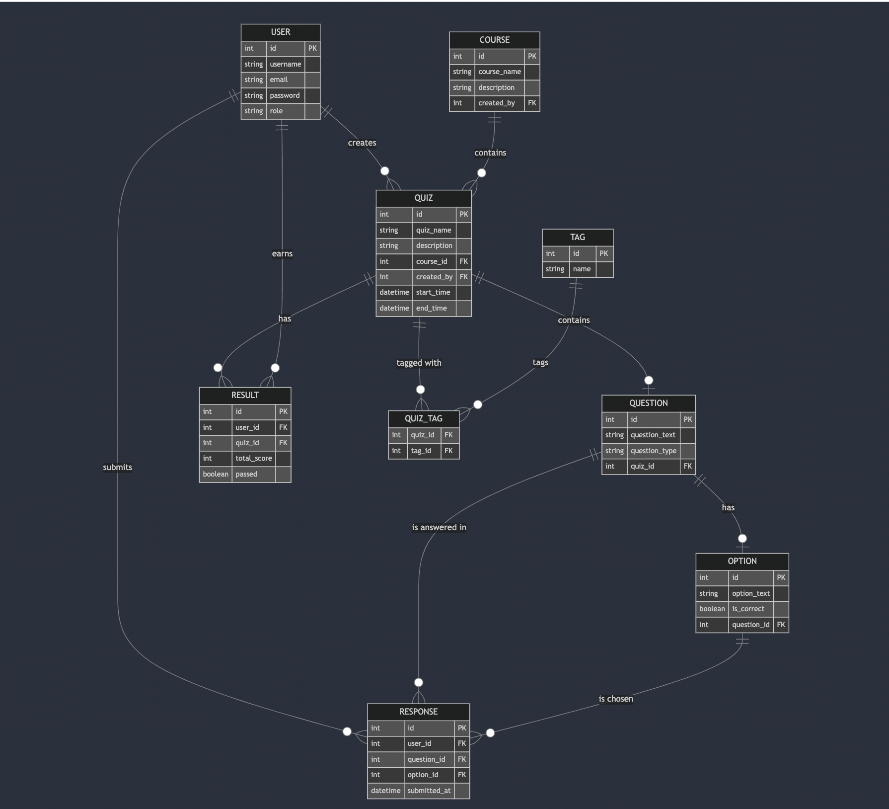

 # Education App Data Model

## Project Overview
This project involves creating and simulating a data model for an education app that handles users, courses, quizzes, questions, and results. The model is designed and implemented in PostgreSQL using an ER diagram. A Python ORM script is provided to generate and populate the database with realistic, normalized data. Additionally, a Dockerized PostgreSQL environment ensures easy setup and demonstration. The project also includes a Poetry environment for managing dependencies and running Python scripts like `models.py` and `simulate_data.py`.

## ER Diagram

The data model is based on the following **Entity-Relationship (ER) Diagram**:



The diagram outlines the relationships between the major entities in the education app:

- **USER**: Represents a user in the system with attributes like `username`, `email`, `password`, and `role` (e.g., student, teacher).
- **COURSE**: Represents a course created by a user, containing quizzes.
- **QUIZ**: Represents a quiz that belongs to a course and contains multiple questions. A quiz may also be tagged with various topics.
- **QUESTION**: Represents a question within a quiz, with multiple possible answer options.
- **OPTION**: Represents the possible answers for a question, with one or more marked as correct.
- **RESPONSE**: Represents the user's submitted answers to the quiz questions.
- **RESULT**: Represents the outcome of a quiz for a user, including the total score and pass/fail status.
- **TAG**: Represents tags that categorize quizzes, allowing them to be grouped by topic.
- **QUIZ_TAG**: A junction table connecting quizzes and tags, allowing for a many-to-many relationship.

### Relationships
- A **USER** can create many **COURSES**, and each course contains multiple **QUIZZES**.
- Each **QUIZ** contains many **QUESTIONS**, and each question has multiple **OPTIONS**.
- **RESULT** tracks the scores of users who take quizzes, while **RESPONSE** records their answers to individual questions.
- **QUIZ_TAG** links quizzes with tags to categorize them into different topics.

## Getting Started

### Prerequisites
To run this project locally, you'll need the following:
- **Python** (for ORM scripting and data generation)
- **PostgreSQL** (as the database engine)
- **Docker** (for setting up a containerized environment)
- **Poetry** (for managing Python dependencies and environment)
- **DBeaver** or any other PostgreSQL database management tool (optional, for database visualization)

### Project Setup

1. **Clone the Repository**  
   Clone this repository to your local machine:
   ```bash
   git clone https://github.com/your-username/edu-app-data-model.git
   cd edu-app-data-model
   ```

2. **Docker Setup**  
   A `docker-compose.yml` file is included to easily set up a PostgreSQL container.

   Run the following command to start the container:
   ```bash
   docker-compose up -d
   ```

   This will create a PostgreSQL container named `education_app_db`.

3. **Environment Variables**  
   Ensure you have a `.env` file in the project root that contains the following sensitive credentials:

   ```
   POSTGRES_USER=postgres
   POSTGRES_PASSWORD=yourpassword
   POSTGRES_DB=postgres
   POSTGRES_HOST=localhost
   POSTGRES_PORT=5432
   ```

4. **Poetry Environment Setup**  
   This project uses **Poetry** for managing dependencies and running the Python scripts. Ensure you have Poetry installed on your machine.

   To install the dependencies, run:
   ```bash
   poetry install
   ```

   This will create a virtual environment and install all necessary packages, including SQLAlchemy, Faker, and Psycopg2. The `pyproject.toml` and `poetry.lock` files define all required dependencies for the project.

5. **Activating the Poetry Environment**  
   To activate the Poetry environment and run Python scripts, use the following command:
   ```bash
   poetry shell
   ```

6. **Database Initialization Options**  
   There are two ways to create the tables in the PostgreSQL database:

   - **Using Python ORM**:  
     The `models.py` file contains the SQLAlchemy ORM definitions for the database. This script can automatically create tables and simulate data.
     Run the following command within the Poetry environment to create the tables using ORM:
     ```bash
     poetry run python models.py
     ```
     This is the recommended method, as it can also be integrated with the data simulation script.

   - **Using SQL Script (Manual Option)**:  
     Alternatively, you can use the `tables.sql` file to create the tables manually if needed. This option can be useful for visualizing the physical schema or for users who prefer SQL scripts.

     Run the following command inside a PostgreSQL client like DBeaver:
     ```sql
     \i sql/tables.sql
     ```

7. **Simulate Data**  
   The `simulate_data.py` script is designed to generate realistic, normalized data for testing purposes. It uses Faker and SQLAlchemy to populate the database with users, courses, quizzes, questions, and responses.

   To simulate data, run the following command within the Poetry environment:
   ```bash
   poetry run python simulate_data.py
   ```
   This script will populate the database with data for users, courses, quizzes, questions, options, and results.

8. **.gitignore**  
   The `.gitignore` file includes rules to ignore sensitive files like `.env`, Python cache files, and Docker data:

   ```
   .env
   __pycache__/
   *.pyc
   .pytest_cache/
   db_data/
   ```

## Demonstration

After setting up the Docker container and running the ORM or SQL script to create the tables, you can use a tool like DBeaver to connect to the PostgreSQL database and visualize the data. You can also query the tables directly to verify that the data model is functioning as expected.
